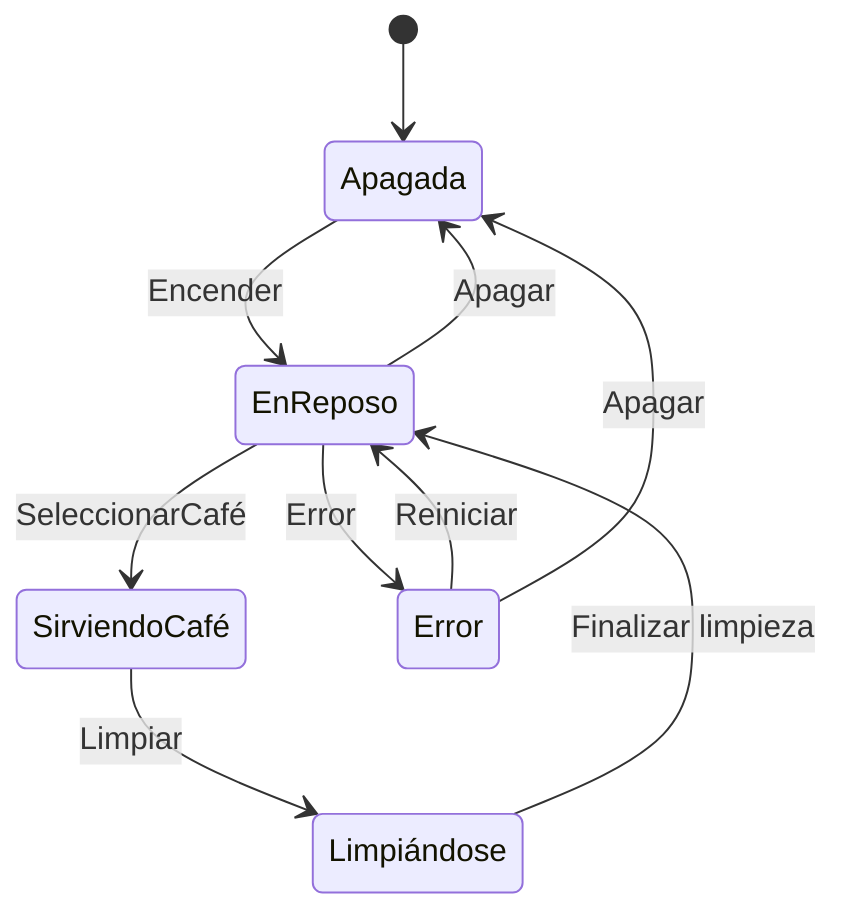
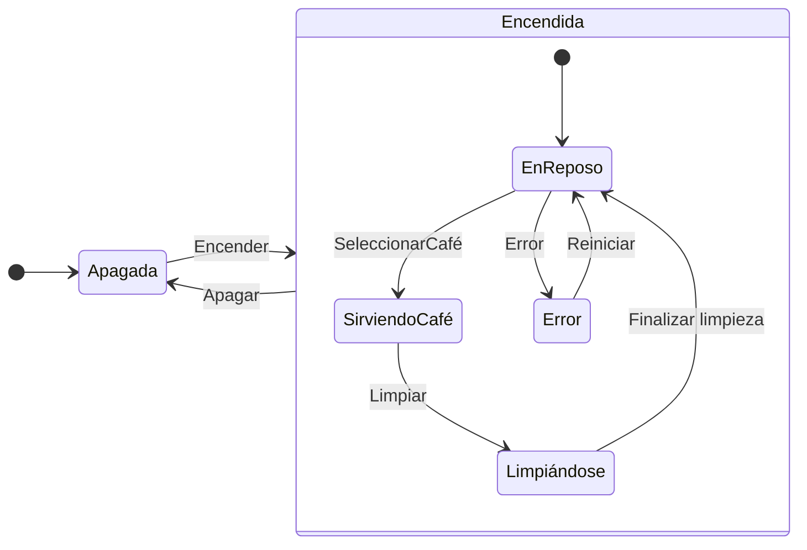
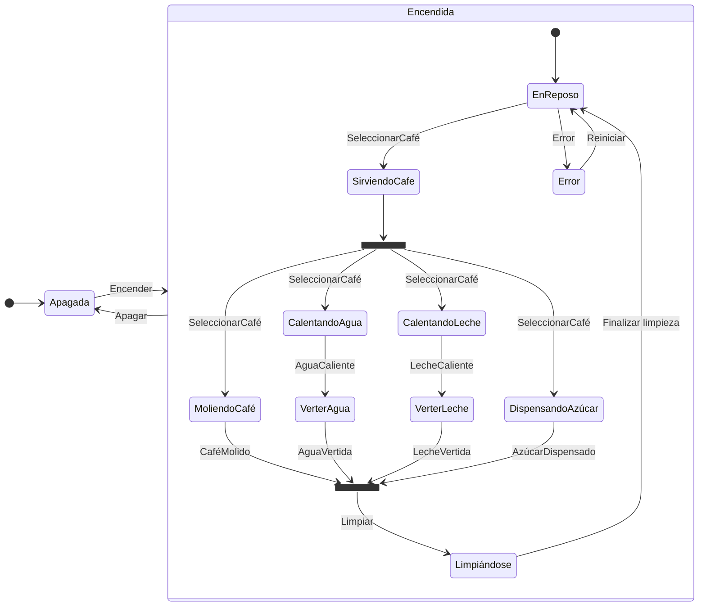
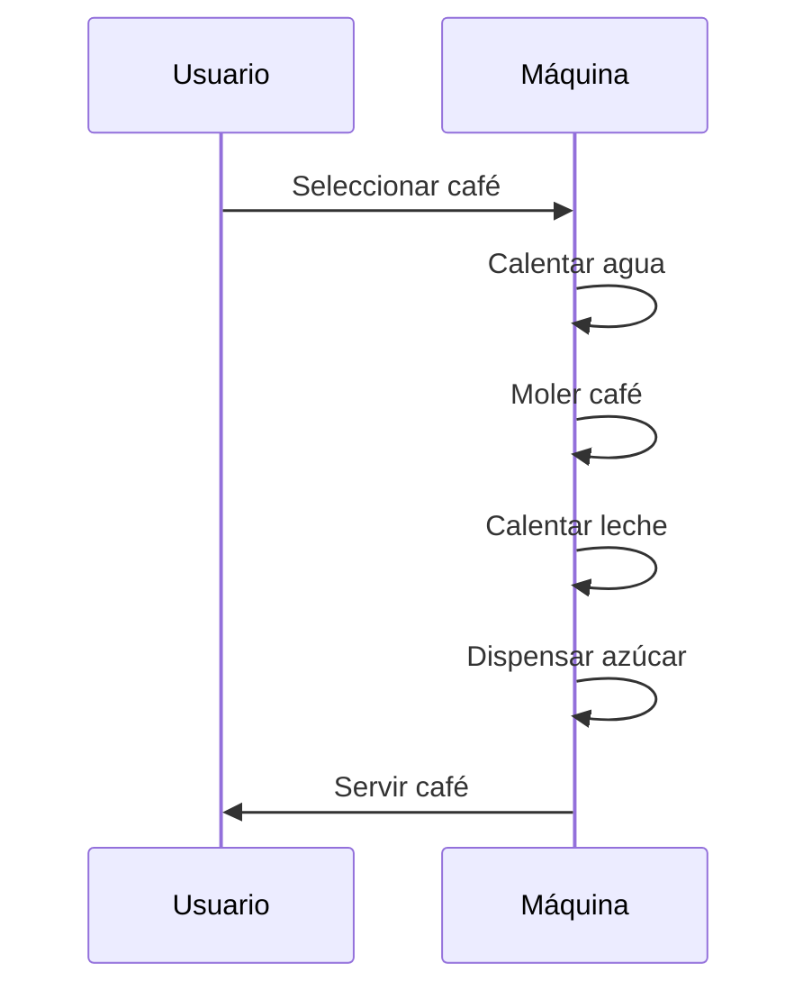

# EA: Enterprise Architect

¿Qué es EA?

EA es una herramienta de modelado y diseño de software que permite a los desarrolladores 
crear diagramas UML, BPMN y otros tipos de diagramas de software, principalmente (básicamente para desarrollo de sistemas usando POO).

## UML

Lenguaje unificado de modelado GRÁFICO!
Lo que se trata es de poner coherencia en los gráficos (diagramas) que se hacen para explicar:
- La estructura de un sistema           Diagramas estructurales/estáticos
  - Diagrama de casos de uso.
  - Diagramas de estados (máquinas de estados).
  - Diagrama de Clases (clases, atributos, métodos, privados, protegidos, abstractos).
  - Diagramas de paquetes de clases.
  - Diagramas de componentes.
- El comportamiento de un sistema       Diagramas de comportamiento/dinámicos
  - Diagramas de actividades.
  - Diagramas de secuencia (comunicación).
  - Diagramas de colaboración.
  - Diagramas de procesos de negocio / comunicaciones

Es un estándar ISO. Es un puro! Si me la cojo con papel de fumar.

# Diagrama de Casos de Uso

Es un diagrama que muestra las interacciones entre un sistema y sus actores:
- Qué hace el sistema?              CASOS DE USO
- Quién va a hacer cada cosa?       ACTORES

# Diagrama de máquina de estados

MAQUINA DE ESTADOS es una forma de modelar el comportamiento de un sistema.
Yo puedo hacer que un sistema se comporte de acuerdo a una máquina de estados:
- ESTADO                Una situación en la que se puede encontrar un sistema.
- TRANSICIÓN            La forma en la que un sistema pasa de un estado a otro.
  - Guarda              Condición que se debe cumplir para que se produzca la transición.
  - Acción              Consecuencias de la transición.
- EVENTO                Los eventos son las interacciones que se producen entre el sistema y el entorno. Algunos eventos pueden ser disparadores de transiciones.

Vamos a modelar el comportamiento de una máquina dispensadora de café!

- Estados?
  - Apagada
  - En reposo
  - Error
  - Sirviendo café
  - Limpiándose

Esta máquina de estados responde a diseños clásicos de máquinas de estados: Moore, Mealy.
- Los estados se nombran mediante: Sustantivos o Adjetivos
- Las transiciones se nombran mediante: Verbos

UML amplió mucho lo que podemos definir en una máquina de estados y cómo entender las máquinas de estados. Posteriormente lo que encontramos es muchos frameworks de desarrollo de software que implementan las funcionalidades que UML ofrece sobre máquinas de estados.

Funcionalidades extendidas de UML con respecto a máquinas de estados:
- Jerarquía de estados: APAGADO/ENCENDIDO (estado compuesto: En reposo, Sirviendo café, Limpiándose, Error)

- Regiones paralelas:
  En nuestro caso, sirviendo café:
    - Calentando agua -> Verter agua    \
    - Moliendo café   ->                 \
    - Calentando leche -> Verter leche   / Listo
    - Dispensando azúcar                /

Los modelos no son los gráficos. Los gráficos (diagramas) son representaciones de características concretas de un modelo. Viendo los diagramas me resulta más sencillo entender ciertos aspectos de un sistema. Pero el modelo va más allá de lo que se ve en los diagramas.

Mediante muchos diagramas de muchos tipos diferentes, puedo entender cómo está hecho y cómo se comporta un sistema.

- Hay gráficos que nos ayudan a enteder qué hace un sistema y quién interactúa con él.
- Hay gráficos que nos ayudan a entender en que estados se puede encontrar un sistema y cómo se comporta.
- Hay gráficos que nos ayudan a entender la estructura interna de un sistema: Componentes
- Hay gráficos que me ayudarán a entender las interacciones entre los componentes / Actores de un sistema: Diagramas de secuencia, diagramas de colaboración.

# Diagramas de secuencia

Actor (solicita un café) -> Máquina de café (sirve café) -> Actor (recibe café)

---

Aplicación: Quiero un programa que pueda ejecutar desde una terminal /consola que permita: gestionar diccionarios y buscar palabras en diccionarios.

# Requisitos del sistema

## Requisito no funcional

- Tiempos de búsqueda más o menos garantizados ("razonables" < 500ms el 95% de las peticiones)
- Quiero un sistema cuya funcionalidad pueda ser ampliada en el futuro sin que suponga un importante esfuerzo de desarrollo.
- Podría querer un sistema distribuido (donde parte se ejecute en un servidor y parte en el cliente)
  - Desde el cliente quiero poder lanzar las búsquedas
  - Las búsquedas realmente se hacen en el servidor... que es quien emite las respuestas.

## Requisitos funcionales
  - Buscar palabras que empiecen por una letra!
  - El sistema, al hacer una búsqueda debe distinguir entre mayúsculas y minúsculas.... o no?
      ángel -> PRIMERO que busque ángel ... y quizás pueda adicionalmente mostrarme la palabra Ángel (alternativa)
      Manzana (manzana)
  - El sistema debe soportar diccionarios en múltiples idioma.. No es un diccionario de traducción, sino un diccionario de significados.
    - casa / ES
    - house / EN
  - Que podamos actualizar los diccionarios ~ Que podamos añadir palabras a los diccionarios. 
  - Debemos poder exportar/importar diccionarios.

## Actores

Usuario que busca palabras en el diccionario.
Usuario que actualiza el diccionario.
Quién guarda/custodia los diccionarios.

## Diagrama de casos de uso

        ACTORES                   CASOS DE USO

        Usuario Buscador          Buscar palabras exactas
                                  Buscar palabras que empiecen por una letra
                                  Buscar palabras que sen similares a una palabra
                                    Murciegalo -> Murciélago

        Usuario Editor            Añadir palabras al diccionario
                                  Eliminar palabras del diccionario
                                  Modificar palabras del diccionario
                                  Crear diccionario

        Usuario custodio          Persistir diccionario (guardarlos de alguna forma)
                                  Proveer diccionarios
                                  Exportar diccionario
                                  Importar diccionario

## Qué componentes va tener mi sistema y cómo se interrelacionan entre si: DEPENDENCIAS TIENEN ESOS COMPONENTES

              App cliente       ---> INTERFAZ <---    App Servidor      -->  INTERFAZ  <---   BBDD
Cometido      Comunicaciones con el servidor          Lanzar queries a la BBDD
              Interactuar con el usuario              Comunicación con el cliente
                                                      Lógica de las palabras
                                                      Gestionar permisos
              App edición                             Gestión de las palabras
              Comunicaciones con el servidor
              Interactuar con el usuario

DIAGRAMA DE COMPONENTES

### Problemas de mi esquema de componentes?

#### Inversión de dependencias

  De quién depende mi App. cliente? Del servidor.. Y si el día de mañana decido cambiar la implementación (el componente) servidor? Tengo que cambiar también el cliente = RUINA !!!!!
  De quién depende App.Servidor? De la BBDD... Y si el día de mañana decido cambiar la implementación de la BBDD? Tengo que cambiar también el servidor = RUINA !!!!!
    Oracle -> MySQL -> MongoDB

  Lo que tenemos es un problema de dependencias. No puedo hacer que a componentes les lleguen flechas.
  Necesito darle la vuelta a esas flechas: INVERSIÓN DE DEPENDENCIAS

  Eso lo hacemos definiendo claramente INTERFACES DE COMUNICACION entre los componentes
  En el software a esas interfaces de comunicación se les llama API (Application Programming Interface)
  En el hardware:
    - USB/HDMI
    - Bicicleta y un sillín... Necesitaré un estandar acerca de cómo se acopla un sillín al cuadro:
      Tornillos: Cuantos, que medidas, con que separación, profundidad, etc.

#### Se mezclan demasiados cometidos en un solo componente. Y qué problema tiene eso?

- Sistema demasiado complejo de crear / implementar... Tengo algo que debe hacer muchas cosas: DIVIDE Y VENCERÁS
- Difícil de mantener... Si algo falla, no sé dónde está el problema.
  Y su hay que arreglar algo... tengo que tocar un componente que es muy complejo... por tener muchos cometidos.
- Difícil de evolucionar... Si quiero añadir una funcionalidad, tengo que tocar un componente que ya tiene muchas cosas.
- O si quiero cambiar un componente por otro

En el mundo del desarrollo de software hay unos principios que nos ayudan a tener visión desde el principio del proyecto... para que no nos pase esto: SOLID

#### Single Responsability Principle:

Un componente solo debe atender a un único actor.
En cierta forma, este principio se malinterpreta a veces com otro principio: SOC (Separation of Concerns)
SOC: Separar las preocupaciones. Cada componente debe atender a una única preocupación.